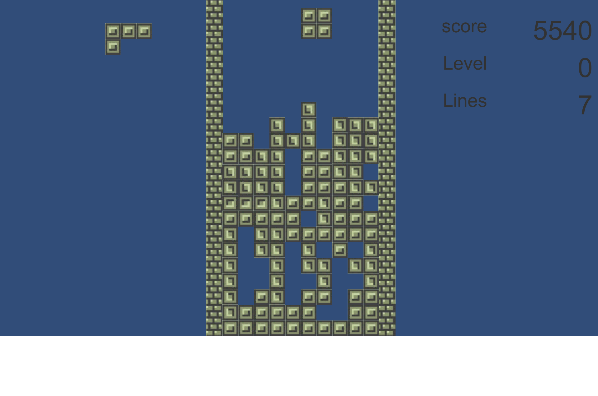

# TetrisJA

## Code and Graphics:
They can be found in Asset folder. Scripts are made by Csharp.

Assets/Scripts:
- Game.cs
- GameMenu.cs
- MenuSys.cs
- Tetromino.cs

## Tetris JA:
Powered by Unity, Visual Studio

